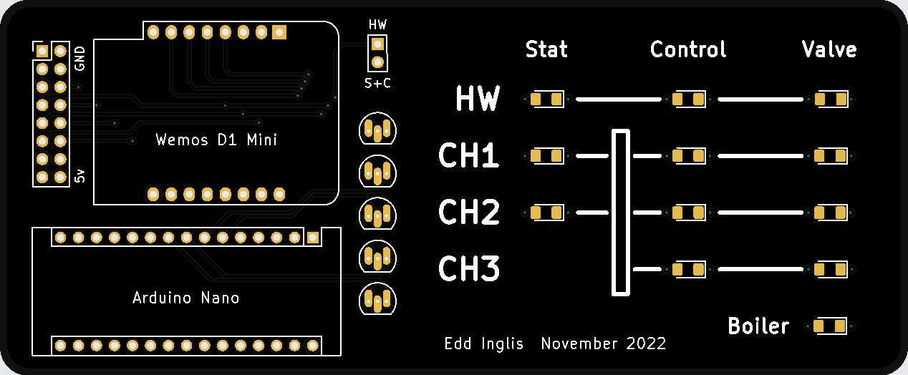
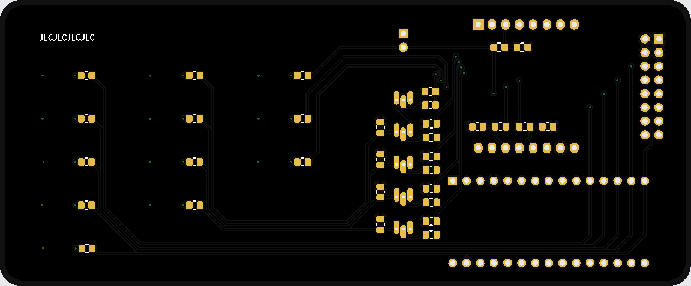
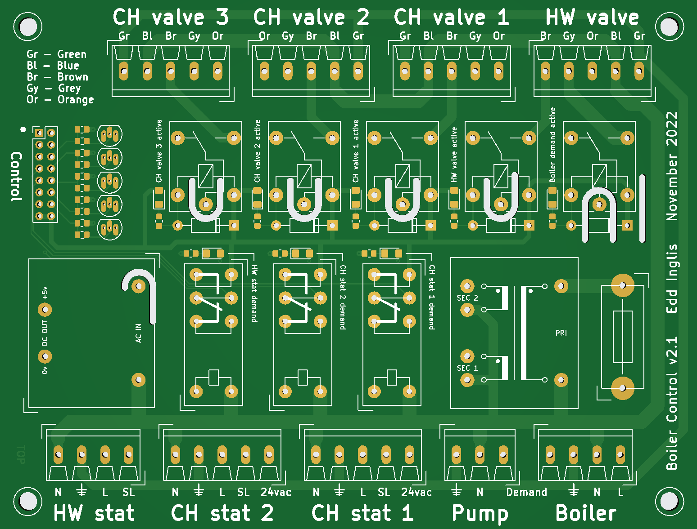
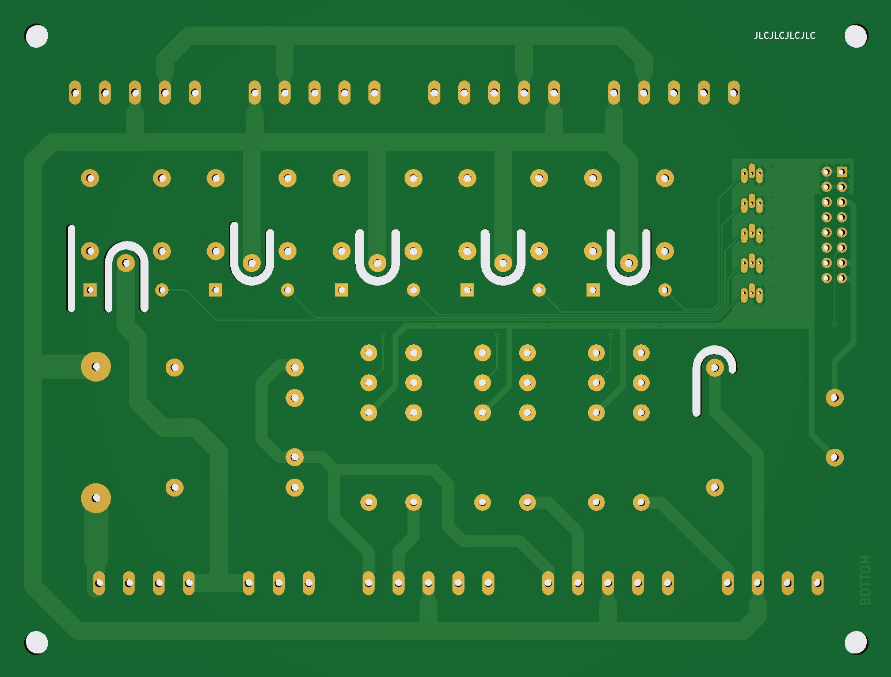
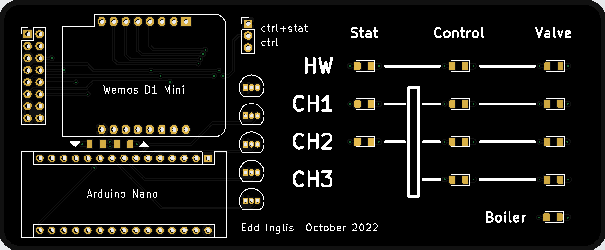
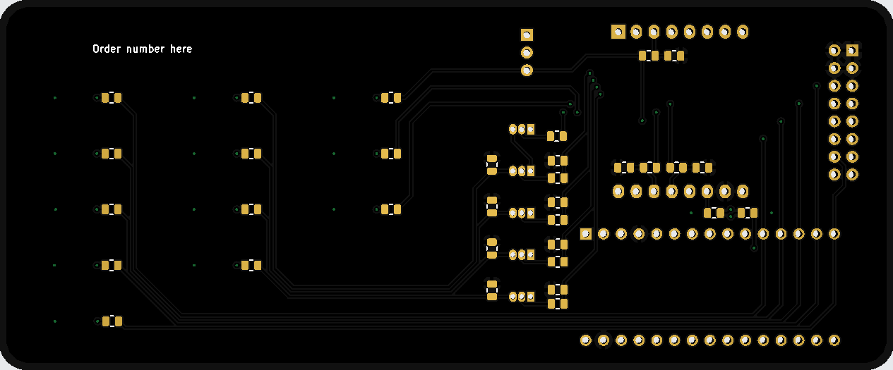
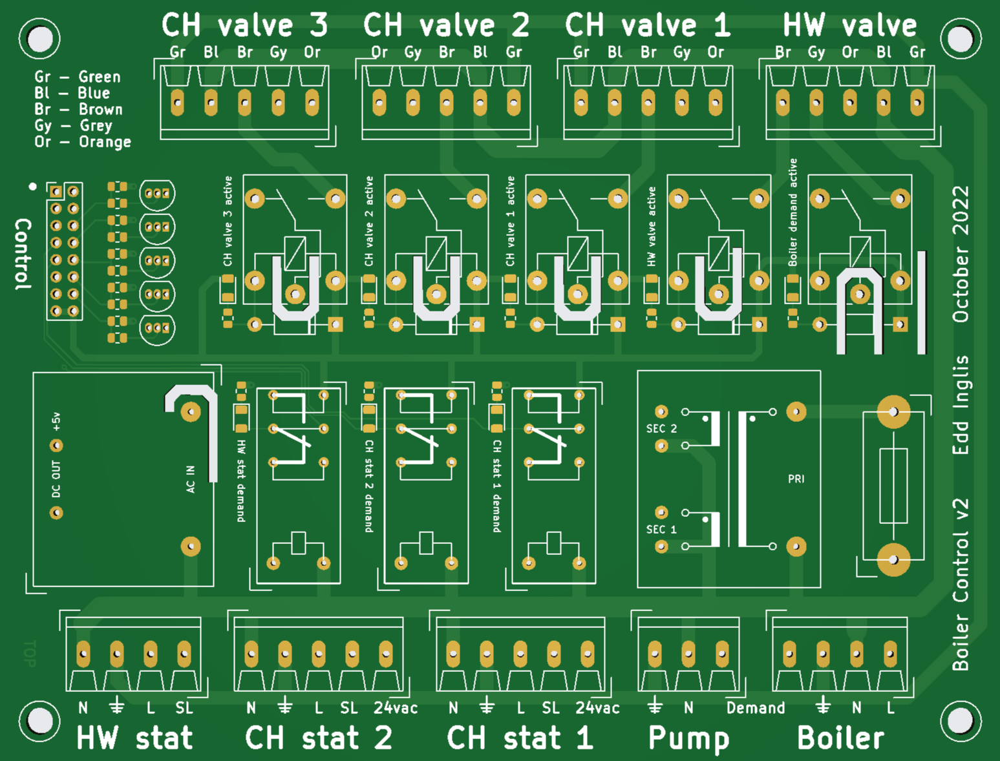
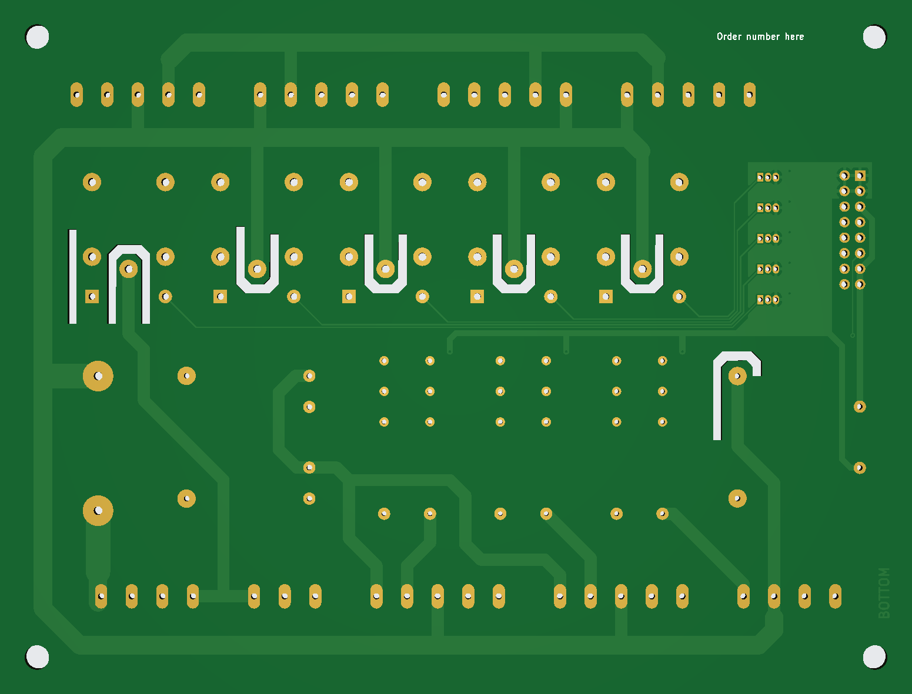

# Boiler Controller mk2

A whole new controller retaining the original features:

* Delayed closing valves
* Support for 24vac Nest thermostat (early US model)

And several new features:

* Multiple heating channels (zoned heating)
* ESP8266 for control and scheduling
* Greater flexibility in stat to valve mappings

The main MCU is an ESP8266 running https://github.com/einglis/SimpleNode/tree/main/examples/heating (still a WIP at the time of writing)

The valve controller is an Arduino Nano running https://github.com/einglis/boiler_valves

## HW versions

The first main board (control) had lots of drill holes that were too small; its replacement addesssed this and tidied up a few little details.

The first MCU board had pads that were too tiny to practically solder the transistors; its replacement added bigger pads, deleted the on-board status LEDs (since the MCUs have thier own), and simplified the ctrl+stat selector for the Hot Water valve.

Both replacements fixed an embarassing error where I hadn't read the ordering instructions, leaving a "Order Number Here" label present on both boards  ...along with the actual order numbers.

## v2.1 Pictures

## v2.0 Pictures

